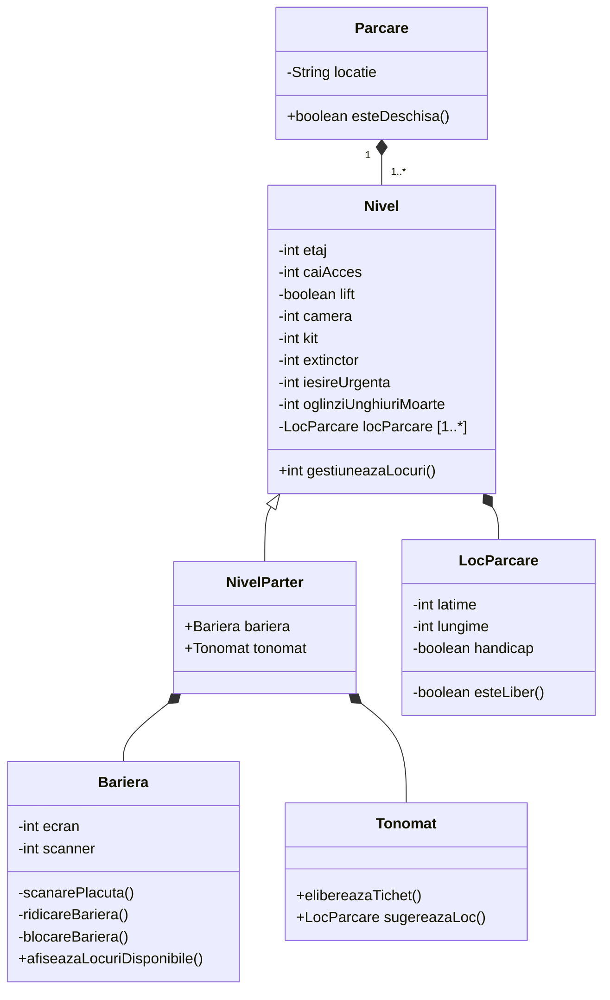

# Lista de Cerințe

1. să aibă mai multe niveluri ✅
2. să aibă mai multe intrari și ieșiri ✅
3. să identifice plăcuțele ✅
4. să monitorizeze disponibilitatea locurilor ✅
5. să sugereze un loc de parcare ✅
6. să obstrucționeze ieșirea/intrarea celor care nu respectă condițiile de folosire (e.g. plata parcării, locuri disponibile etc.) ✅
7. să faciliteze accesul persoanelor cu handicap ( locuri speciale ) ✅
8. să aibă un sistem de supraveghere video ✅
9. să fie dotată cu kit-uri de prim ajutor ✅
10. să fie dotată cu extinctoare de incendiu ✅
11. să aibă oglinzi pentru unghiuri moarte ✅
12. să aibă lift pentru navigarea rapidă între etaje ✅
13. să aibă ieșiri de urgență ✅

